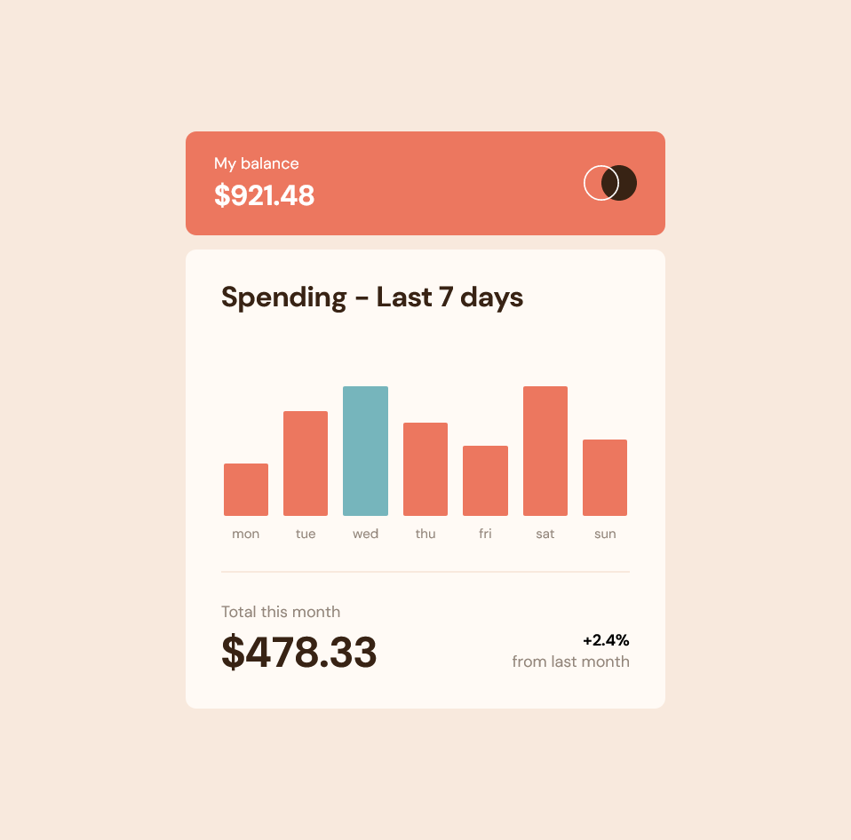

# Frontend Mentor - Expenses chart component solution

This is a solution to the [Expenses chart component challenge on Frontend Mentor](https://www.frontendmentor.io/challenges/expenses-chart-component-e7yJBUdjwt). Frontend Mentor challenges help you improve your coding skills by building realistic projects. 

## Table of contents

- [Frontend Mentor - Expenses chart component solution](#frontend-mentor---expenses-chart-component-solution)
  - [Table of contents](#table-of-contents)
  - [Overview](#overview)
    - [The challenge](#the-challenge)
    - [Screenshot](#screenshot)
    - [Links](#links)
  - [My process](#my-process)
    - [Built with](#built-with)
    - [Useful resources](#useful-resources)
  - [Author](#author)

## Overview

### The challenge

Users should be able to:

- View the bar chart and hover over the individual bars to see the correct amounts for each day
- See the current day’s bar highlighted in a different colour to the other bars
- View the optimal layout for the content depending on their device’s screen size
- See hover states for all interactive elements on the page
- **Bonus**: Use the JSON data file provided to dynamically size the bars on the chart

### Screenshot

### Links

- Solution URL: https://www.frontendmentor.io/solutions/expenses-chart-component-AkKfY0bfXu
- Live Site URL: https://andrew2764.github.io/expenses-chart-component/

## My process

### Built with

- Flexbox
- CSS Grid
- Mobile-first workflow

### Useful resources

- [How To Make Tooltips With Only CSS](https://www.youtube.com/watch?v=ujlpzTyJp-M) - This was my first time writing a tooltip from scratch. I followed this tutorial from Web Dev Simplified. It helped immensely and also helped me get more familiar with using CSS pseudo elements

- [CSS Grid Course](https://cssgrid.io/) - I used CSS grid to implement the layout of the bar charts. I initially was not familiar with it, so I went through this course by Wes Bos to get myself up to speed.

## Author

- Frontend Mentor - [@andrew2764](https://www.frontendmentor.io/profile/andrew2764)
